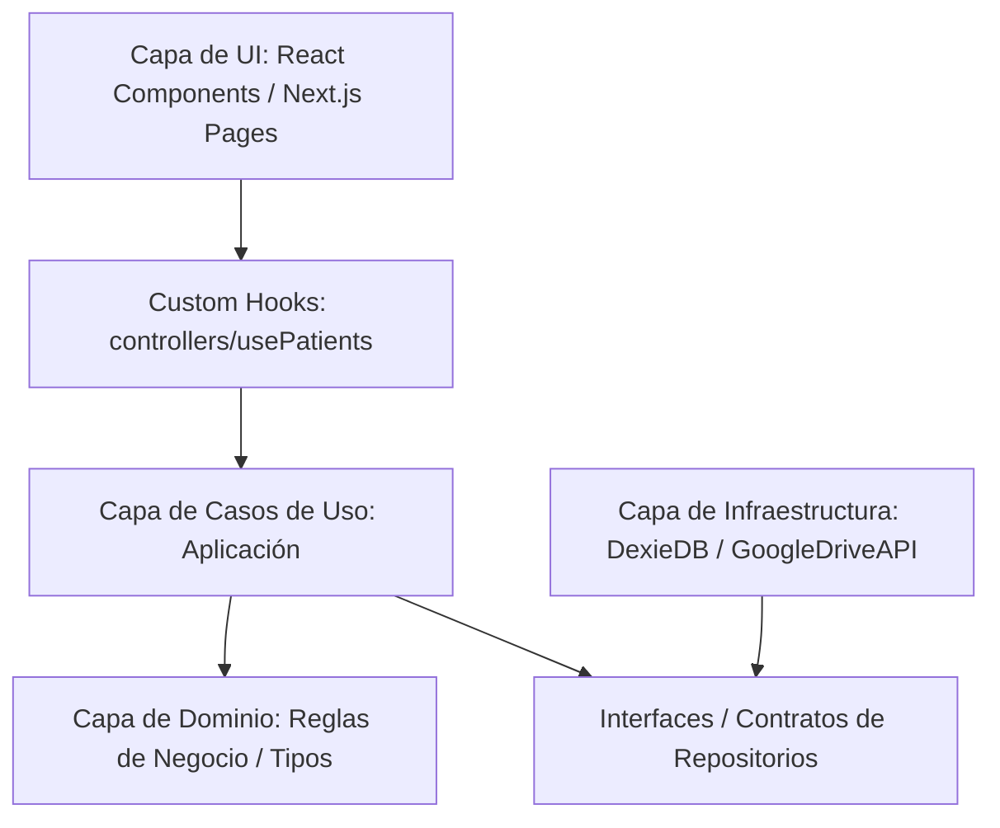

# Hito 1: Infraestructura y Núcleo de Seguridad - PSICO-AGENDA

Esta propuesta técnica y de diseño detalla la planificación y la base arquitectónica para el primer hito de la aplicación. Siguiendo tus directivas, diseñaremos un sistema **altamente modular, desacoplado y orientado al aprendizaje**, evitando el código espagueti o monolítico mediante principios de **Clean Architecture** (Arquitectura Limpia).

---

## 1. Fundamento Conceptual: Clean Architecture en Next.js

Para evitar que el código sea una "masa" indescifrable donde la base de datos local o la API de Google se mezclen con el diseño de la pantalla (UI), estructuraremos el proyecto en **capas desacopladas**. Esto te permitirá aprender cómo separar responsabilidades de verdad:



### Capas del Proyecto:
1. **Domain (Dominio)**: Contiene los tipos de datos puros y las reglas de negocio (por ejemplo, qué define a un `Patient` o una `Session`). No conoce nada de React, ni de Dexie, ni de Google Drive. Es TypeScript puro.
2. **Use Cases (Casos de Uso)**: Acciones específicas del sistema (ej. `createPatient`, `syncDataWithDrive`). Orquestan el flujo de datos.
3. **Interfaces/Repositories (Contratos)**: Definiciones abstractas de cómo se guardan los datos (ej. `IPatientRepository`).
4. **Infrastructure (Infraestructura / Adaptadores)**: Las implementaciones reales de los contratos. Aquí vivirá **Dexie.js** y la lógica del SDK de **Google Drive**. Si en el futuro querés cambiar Dexie por SQLite, solo cambiás esta capa sin tocar nada de la UI o los Casos de Uso.
5. **UI / Presentation**: Componentes visuales de React. Solo consumen Custom Hooks que exponen los casos de uso.

---

## 2. Arquitectura de Datos Local (Dexie.js / PouchDB)

> [!TIP]
> **Dexie.js** es un wrapper minimalista y súper potente sobre IndexedDB (la base de datos nativa del navegador). Es ideal para un enfoque offline-first porque maneja transacciones de forma ultra-rápida y tiene una sintaxis de queries hermosa compatible con TypeScript.

Diseñaremos un **`DexiePatientRepository`** que implemente la interfaz `IPatientRepository`. Toda la app consumirá la interfaz, logrando que la persistencia local sea un detalle técnico intercambiable.

---

## 3. Propuesta de Estructura de Directorios

Estructuraremos la carpeta `src` de la siguiente forma modular:

```text
/src/
├── domain/                  # Entidades puras y reglas de negocio
│   ├── patient.types.ts
│   └── session.types.ts
├── use-cases/               # Casos de uso de la aplicación
│   ├── get-patients.ts
│   └── create-patient.ts
├── repositories/            # Contratos e interfaces
│   └── patient.repository.ts
├── infrastructure/          # Implementaciones concretas
│   ├── db/
│   │   ├── dexie.db.ts      # Instancia de Dexie
│   │   └── dexie-patient.repository.ts
│   └── drive/
│       └── google-drive.adapter.ts
└── ui/                      # Capa de presentación (React)
    ├── components/          # Componentes visuales y atómicos
    ├── hooks/               # Custom Hooks controladores (ej. usePatients.ts)
    └── pages/               # Páginas de Next.js (App Router)
```

---

## 4. Plan de Acción y Próximos Pasos para la Inicialización

Para arrancar el desarrollo paso a paso (TDD-ready y modular):

1. **Bootstrap del Entorno**: Inicializar Next.js en su versión más limpia y robusta, configurando Tailwind CSS (si lo deseás) o Vanilla CSS encapsulado para máxima prolijidad de diseño.
2. **Definición del Dominio y Contratos**: Escribir los archivos TypeScript de dominio para que entiendas cómo se modelan los datos antes de codear lógica de base de datos.
3. **Configuración de Dexie.js**: Crear la clase de base de datos local y su repositorio para habilitar la persistencia local instantánea.
4. **Implementación de Componentes Atómicos**: Crear la UI base del Dashboard y la ficha del Paciente para probar el guardado local.
5. **Autenticación y Adaptador de Drive**: Conectar con Google Drive para sincronizar los JSONs locales a la nube del usuario en segundo plano.
